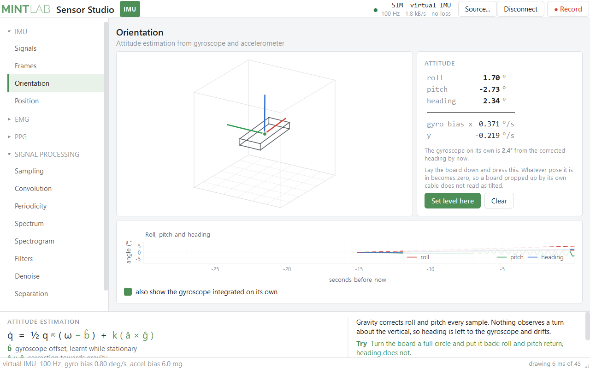
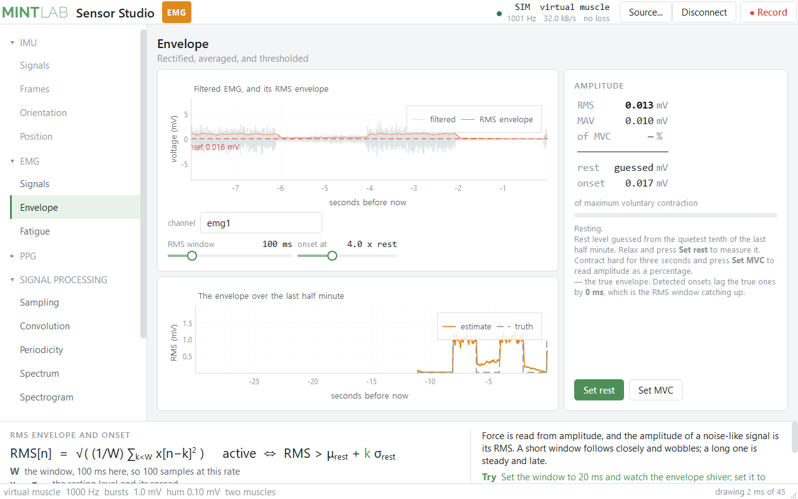
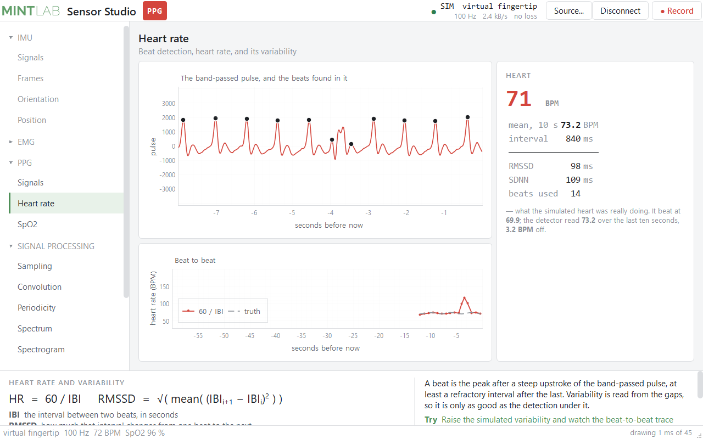
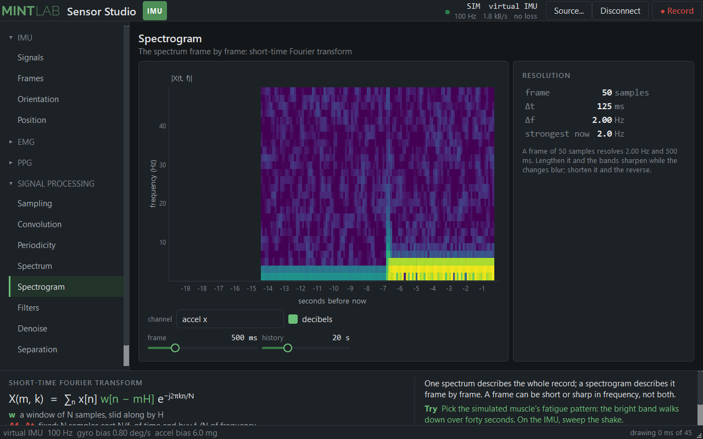

<div align="center">

# MINT Sensor Studio: one window for sensors and the methods that read them

Yuhyeon Lee · 2026

[](https://github.com/blueion0612/Mint_Sensor_Studio/actions/workflows/checks.yml)
[](LICENSE)
[](https://www.python.org/)
[](#limitations)
[](#requirements)

[**IMU sketch**](arduino/imu_stream/imu_stream.ino) · [**Analog sketch**](arduino/analog_stream/analog_stream.ino) · [**Sample recording**](data/still_30s.csv) · [**Related**](#related)

<picture>
  <source media="(prefers-color-scheme: dark)" srcset="docs/figures/hero_orientation-dark.png">
  
</picture>

</div>

*The Orientation page on a simulated IMU, in the light and the dark palette. The
window as it draws itself: `python docs/figures/make_hero.py` opens it off screen
and saves what it shows.*

**MINT Sensor Studio** puts one live signal on screen, from an IMU, an EMG board or
a pulse oximeter, over a cable or the radio, from a recording, or from a simulated
sensor. The rail on the left lists the functions: one group per sensor, and the
signal processing that works on any of them. The panel along the bottom gives each
function's equation, why it comes out as it does, and where to read more.

No hardware is needed. Every sensor has a simulated version whose faults are set by
the user, so its truth is known and an estimate's error can be measured rather than
inferred.

It was written as course material for MOBI311, *Sensor Theory and Signal Processing
I*. The code behind each page is what the students write in class and in the
assignments, so the window shows the mathematics and not the code.

## Features

### The rail

| Group | Pages | Needs |
|---|---|---|
| **IMU** | Signals · Frames · Orientation · Position | an IMU |
| **EMG** | Signals · Envelope · Fatigue | an EMG board |
| **PPG** | Signals · Heart rate · SpO2 | a pulse oximeter |
| **Signal processing** | Sampling · Convolution · Periodicity · Spectrum · Spectrogram · Filters · Denoise · Separation | any signal |
| **Signal theory** | Sampling theorem · Aliasing · Quantization · Fourier synthesis · Spectral leakage | nothing: synthetic signals |

A page for another sensor than the one connected is grayed, with the reason in its
tooltip. Click a group name to fold or unfold it. The Signal theory pages read no
sensor, so they work with nothing connected.

### The pages

| Page | What it does | Equation |
|---|---|---|
| Signals | every channel, live | f = a − g · Beer–Lambert · MUAP sum |
| Frames | body axes to world axes | a_world = R a_body, minus g |
| Orientation | attitude, and what keeps it from drifting | q̇ = ½ q ⊗ (ω − b̂) + k (â × ĝ) |
| Position | four estimators on one set of measurements | p = ∬(a + b + g δθ) ⇒ b t²/2 |
| Envelope | RMS envelope, onset, % of MVC | RMS = √(1/W Σ x²) |
| Fatigue | median and mean frequency over time | ∫₀^MDF P = ½ ∫ P |
| Heart rate | beats, HR, RMSSD, SDNN | HR = 60 / IBI |
| SpO2 | ratio of ratios | SpO₂ ≈ 110 − 25 R |
| Sampling | rate, jitter, aliasing, quantization | f_N = f_s / 2 |
| Convolution | an impulse response applied | y = Σ h[k] x[n−k] |
| Periodicity | fundamental frequency, Fourier series | x ≈ a₀ + Σ \|cₖ\| cos(2πk f₀ t + φₖ) |
| Spectrum | DFT with a window | X[k] = Σ w x e^(−j2πkn/N) |
| Spectrogram | STFT | X(m,k) = Σ x w[n−mH] e^(−j2πkn/N) |
| Filters | Butterworth low, high, band, notch; live or zero-phase | y = Σ bᵢ x − Σ aⱼ y |
| Denoise | moving average, median, exponential, Savitzky–Golay | one line each |
| Separation | PCA and ICA of the channels | C v = λ v · x = A s |
| Sampling theorem | samples put back into a signal, and where that fails | x(t) = Σ x[n] sinc(fₛ(t − nTₛ)), fₛ > 2 f_max |
| Aliasing | a frequency above fₛ/2 coming back lower | f_apparent = \|f − k fₛ\| |
| Quantization | bits, step size, and the noise they add | SNR ≈ 6.02 N + 1.76 dB |
| Fourier synthesis | a square, triangle or sawtooth from sinusoids | x = Σ bₖ sin(2πk f t) |
| Spectral leakage | a tone between bins, and what a window does | X[k] = Σ w[n] x[n] e^(−j2πkn/N) |

The panel along the bottom gives each page's equation, what its symbols are, why
the page behaves as it does, something to try, and a link to read more.

|  |  |  |
|---|---|---|
| EMG: envelope, onset, % of MVC | PPG: beats, heart rate, variability | Spectrogram, dark palette |

### Where a signal comes from

| Source | What it is |
|---|---|
| **USB cable** | any board on a serial port. Its header line says what it sends. A board that is plugged in when the window opens is connected on its own |
| **Simulated** | a virtual IMU, muscle (one or two, with crosstalk) or fingertip, with its faults on sliders |
| **Recording** | a CSV played back, at real time or faster, looping if asked |
| **Bluetooth** | the IMU board with no cable, advertising as `IMU-XXXX`; the sketch ships with the radio off (`USE_BLE 0`) |

Everything derived from a signal is derived once, as it arrives, in the session for
that sensor: attitude for the IMU, the filtered signal and its envelope for EMG, the
filtered pulse and its beats for PPG. Pages read; they do not compute, so two pages
cannot disagree.

## Quick start

Python 3.10 to 3.14, on Windows, macOS 13 or newer, or Linux.

```bash
git clone https://github.com/blueion0612/Mint_Sensor_Studio
cd Mint_Sensor_Studio
pip install -e ".[all]"       # or: pip install -r requirements.txt
sensor-studio --check         # what is installed, and the one command that installs the rest
sensor-studio                 # open the window; --dark opens the dark palette
```

`python sensor_studio.py` and `python -m studio` open the same window without the
console script. A board plugged in when the window opens is connected on its own;
otherwise pick a source with **Source…** or Ctrl+K. The simulated sensors and the
Signal theory pages need nothing plugged in.

## Usage

### Choosing a source

**Source…** in the toolbar, or Ctrl+K, offers the four sources above. The toolbar
shows a badge for the connected sensor and a dot beside the rate: green while
samples arrive, amber when some are lost, red when nothing has come for a while.

### Recording and playing back

**Record** (Ctrl+R) writes what arrives to `recordings/<sensor>_<date>_<time>.csv`: a
header row `n,micros,ax_g,...` and one row per sample. `data/still_30s.csv` is thirty
seconds of a real board lying still, to try the Recording source with.

### What the boards send

```
#COLUMNS n,micros,ax_g,ay_g,az_g,gx_dps,gy_dps,gz_dps,mx_ut,my_ut,mz_ut
417,4185922,-0.03137,0.27100,-0.95923,-0.3662,0.6104,-0.3052,102.31,-11.06,180.44
```

`n` counts up by one, so a gap is a lost line; `micros` is the board's clock.
Channels are named `name_unit`, and the kind of sensor is read off the names, so any
board that prints a line like this is understood.

| Sketch | For | Rate |
|---|---|---:|
| [`arduino/imu_stream/imu_stream.ino`](arduino/imu_stream/imu_stream.ino) | the Arduino Nano 33 BLE Sense's IMU, over the cable or the radio | 100 Hz |
| [`arduino/analog_stream/analog_stream.ino`](arduino/analog_stream/analog_stream.ino) | an EMG amplifier or an analog pulse sensor on the analog pins | up to 1000 Hz |

The analog sketch compiles for the Nano 33 BLE and for an Uno; see Limitations for
what it has not yet met.

## Repository layout

```
sensor_studio.py        start here without installing; the same as sensor-studio
studio/
  app.py                the entry point, the dependency report, opening the window
  catalogue.py          the groups and pages the rail shows. Edit this to add or move a page
  modality.py           what a channel is, and which sensor a set of channels adds up to
  dsp.py                streaming filters, the envelope, the beat detector, spectra
  analysis.py           autocorrelation, Fourier series, STFT, smoothers, PCA and ICA
  theory.py             the synthetic-signal arithmetic behind the Signal theory pages
  core.py               the ring buffer, the IMU session and its attitude filter, the estimators
  bio.py                the EMG and PPG sessions
  sources.py            USB, Bluetooth, the three simulators, recordings, the recorder
  theme.py              the two palettes
  shell.py              the window, the source picker, the rail, the bottom panel
  pages_*.py            one class per page
arduino/                the two sketches
data/                   a sample recording
docs/figures/           the hero screenshot and the script that takes it
docs/img/               three more pages, as screenshots
tests/                  the two checks, and the packaging test
pyproject.toml          the package, its extras and the sensor-studio command
requirements.txt        the same list, for pip install -r; a test keeps the two equal
```

## Tests

```bash
python -m pytest -q                   # requirements.txt against pyproject.toml
python tests/check_studio_math.py     # every estimator against the simulators' truth
python tests/check_studio.py          # every page on every simulated sensor: frame cost, layout, record and replay
```

The simulators write the signal first and derive the measurements from it, so the
math check can ask what no bench test can: not whether an estimate drifts, but by how
much it is wrong. It also requires the two attitude backends and the two filter
engines to agree, so that the program behaves the same whatever happens to be
installed. The window check opens the real window on each simulated sensor, visits
every page, works every control, and fails on an exception, a slow frame measured
twice, or two pieces of text drawn over each other; then it records a few seconds,
plays them back through the Recording source, opens the dark palette in the smallest
window the layout is designed for, opens the window on a screen shorter than that
layout to see that it scrolls to the bottom panel, and opens it with nothing
connected to see that every page is offered and the theory pages work in full. The
math check also holds the theory pages' arithmetic to the textbook figures. CI runs
all three, the window check off screen.

## Requirements

| Package | What it is | If missing |
|---|---|---|
| **numpy** | arrays | required |
| **PySide6** | the window (Qt 6) | required |
| **pyqtgraph** | the plots | required |
| pyserial | the USB cable | cable unavailable; radio, simulators and recordings still work |
| bleak | Bluetooth | radio unavailable |
| imufusion | the reference attitude filter | the numpy one in `studio/core.py` is used, and must agree |
| scipy | faster filters | the biquad cascade in `studio/dsp.py` is used, and gives the same answer |

Every package ships a wheel for Windows x86-64, Intel Macs and Apple silicon;
nothing is compiled. imufusion has no wheel for Windows on ARM or for Python 3.15,
so `requirements.txt` and the `fusion` extra leave it out there and the numpy
attitude filter is used; `--check` says so. macOS 13 is Qt's floor: on macOS 12
install `PySide6==6.9.3` first, on macOS 11 `PySide6==6.7.3`. On Linux, Qt wants the
xcb libraries (`sudo apt install libxcb-cursor0 libgl1` on Ubuntu or Debian) and the
serial port wants your account in the `dialout` group. The window draws with
QPainter, not OpenGL, measures its own frame cost, and spaces frames out on a slow
machine. A screen with less room than the layout's 1024 x 640 gets a window that
scrolls, down to 640 x 400.

## Limitations

- **The analog sketch has not been run against a real amplifier.** It compiles for
  both boards; the first person to try it should check the header's `vref` and that
  the trace moves when the muscle does.
- **Bluetooth is for the IMU board only.** EMG and PPG boards stream over the cable.
- **One signal at a time.** Two sources cannot be open together.
- **SpO2 is the ratio-of-ratios approximation** with fixed constants, not a curve
  calibrated against a reference oximeter.
- **A simulated sensor has the faults its sliders offer.** A real board has others.
- macOS 13 is the floor for the current Qt; older Macs need the pinned PySide6 above.
- **Linux has not been run with a real board.** The wheels exist and the checks pass
  off screen; the serial permission and library notes above come from reading, not
  from a session.

## Related

- [PPG_Fist_Classifier](https://github.com/blueion0612/PPG_Fist_Classifier),
  [sEMG_Gesture_Classifier](https://github.com/blueion0612/sEMG_Gesture_Classifier)
  and [IMU_Gesture_Classifier](https://github.com/blueion0612/IMU_Gesture_Classifier):
  the three sensors the rail has, each taken further into a classifier.
- [IMU_Streamer](https://github.com/blueion0612/IMU_Streamer): the same kind of
  inertial signal from a smartwatch and a phone, over UDP instead of a cable.

## Credits

- [Fusion](https://github.com/xioTechnologies/Fusion) by x-io Technologies (MIT): the
  attitude algorithm. Its `imufusion` package is the reference backend, and the numpy
  filter in `studio/core.py` follows the same algorithm so that the program runs
  without it.
- [Qt for Python](https://doc.qt.io/qtforpython-6/), [pyqtgraph](https://www.pyqtgraph.org/),
  [numpy](https://numpy.org/), [scipy](https://scipy.org/),
  [pyserial](https://github.com/pyserial/pyserial) and [bleak](https://github.com/hbldh/bleak).

## License

MIT. See [LICENSE](LICENSE).
